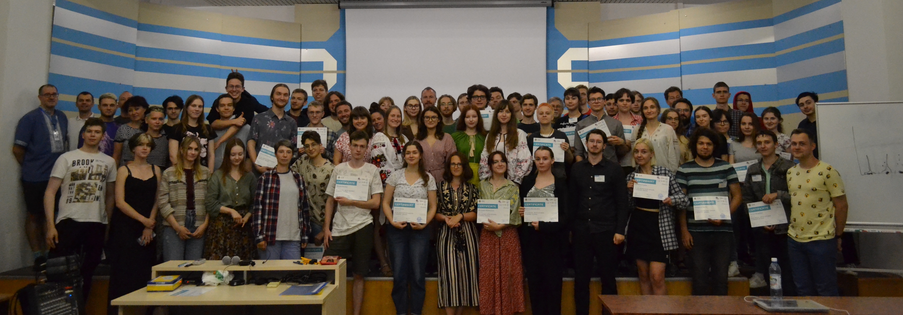
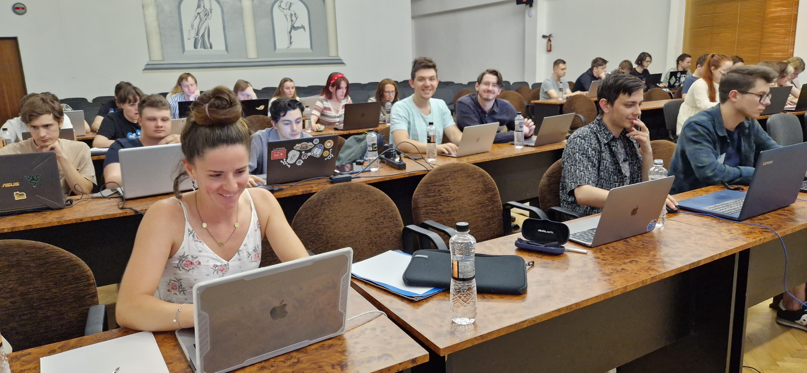
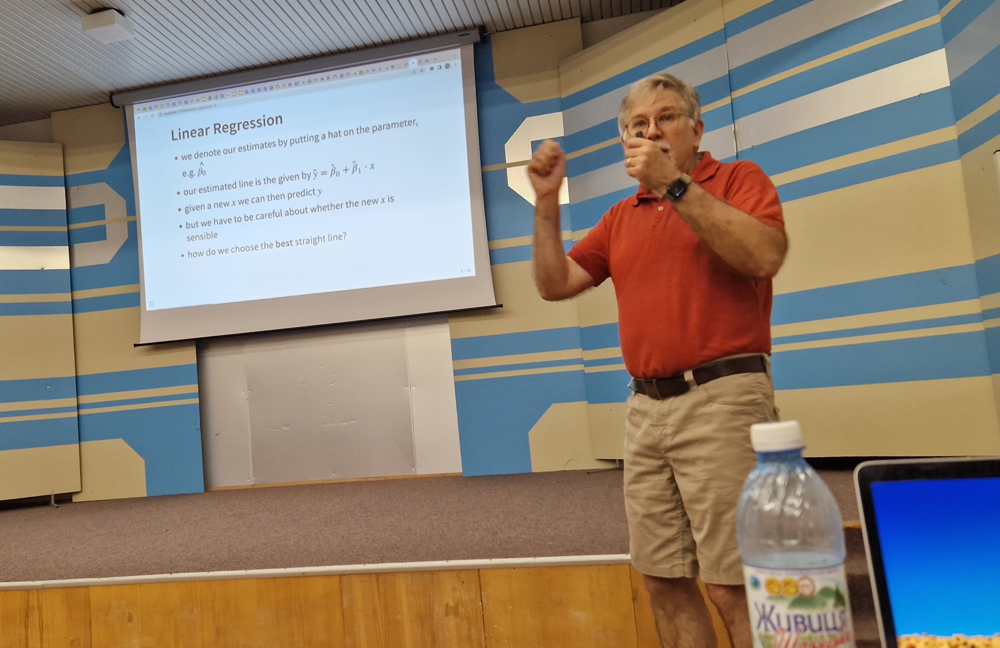
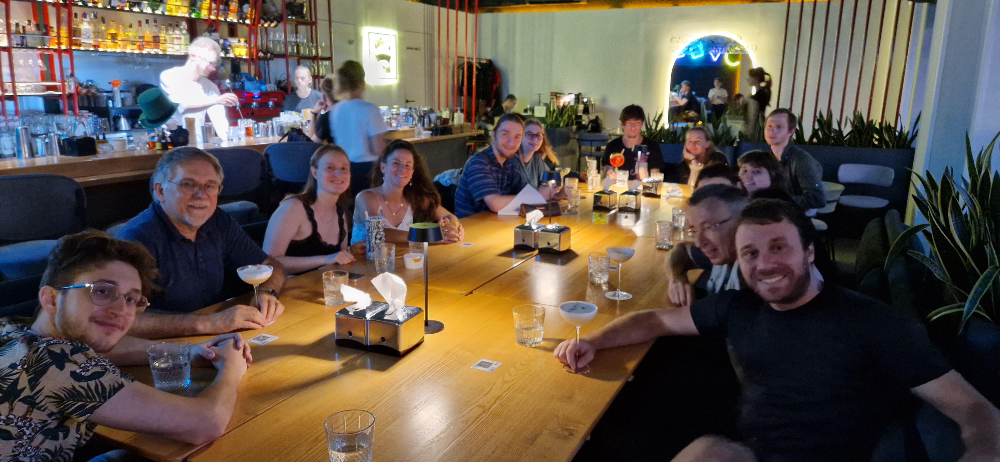
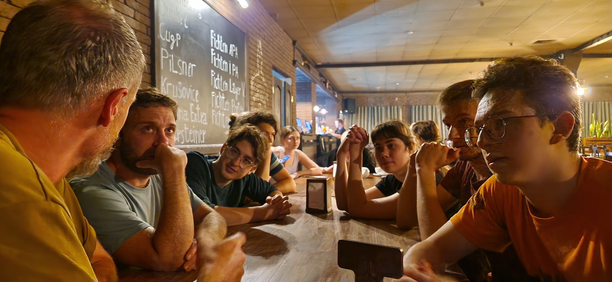

From 2-14 July 2023, [we](https://bds3.org/our-team) organized a [summer school in Ukraine for university students on biological data science](https://bds3.org). Here’s some takeaways:

1. Many students did not want to leave, and faculty members were asking “can we do it again?” (yes). It was a lot of fun.
2. There is a tremendous need for this sort of event. I knew that this is true for mostly anywhere, based on our experience with the [CSAMA summer school](https://csama2023.bioconductor.eu) that regularly attracts students from all over Europe. It’ll be even more so in a country that has incredibly talented young people, but where many potential professors and lecturers have gone into other jobs, or indeed to the nation’s defense. 
3. For some students, it was nearly the first time they experienced in-person teaching in  3 years — as most instruction had been online first with the pandemic, then the rashist invasion.
4. Strong civil society and democracy rest on material and intellectual welfare, and strong research and education. We hope, in our small ways, to help (re)build that.
5. The concept is not restricted to bioinformatics or data science. It is evidently cloneable to other disciplines. Calling computer scientists, mathematicians, physicists, medics, … 
6. If you want to organize such an event, good contact to a local organizer and host institution is essential. Diaspora Ukrainian academics are an obvious mediator, and many are enthusiastic to help.
Include local academics working on the topic. 
7. A complementary and follow-up step will be mentoring networks between students from underprivileged places and backgrounds, and academics who “made it”. There is scope in rolling this out, at scale, in a sustainable manner.
8. The students we met are wonderful people. 
9. Special and deep thanks to our hosts from [Uzhhorod National University](uzhnu.edu.ua), in particular the [Department of International Relations](https://www.uzhnu.edu.ua/en/cat/irelations-dep_irelations), Igor Povkhan, Oleksii Kurutsa, Serge Vronsky, Evgenia Fedorivna Hayovich; and to [Taras Oleksyk](https://oakland.edu/biology/directory/oleksyk) and [Walter Wolfsberger](https://scholar.google.com/citations?user=YtQK0tkAAAAJ&hl=uk) for mediating the contact. 

Ukraine is winning. Слава Україні! 

This really has been a team effort, with great colleagues, each contributing unique skills and resources:
- Organisers: <https://bds3.org/our-team>
- Faculty: <https://bds3.org/faculty>

Related press releases:
- From UZHNU: <https://www.uzhnu.edu.ua/uk/news/biological-data-science-summer-school.htm>
- From OIST: <https://www.oist.jp/news-center/news/2023/8/3/oist-researchers-help-organize-data-science-summer-school-ukraine>

      

